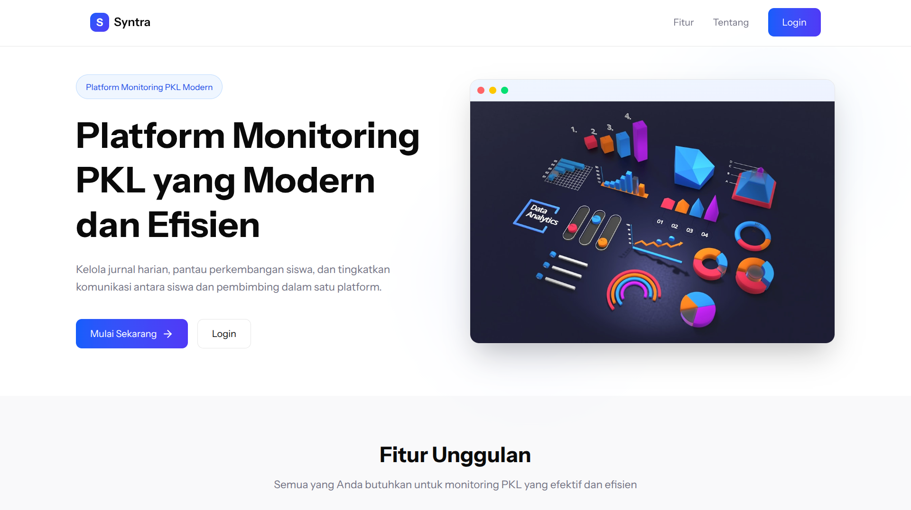
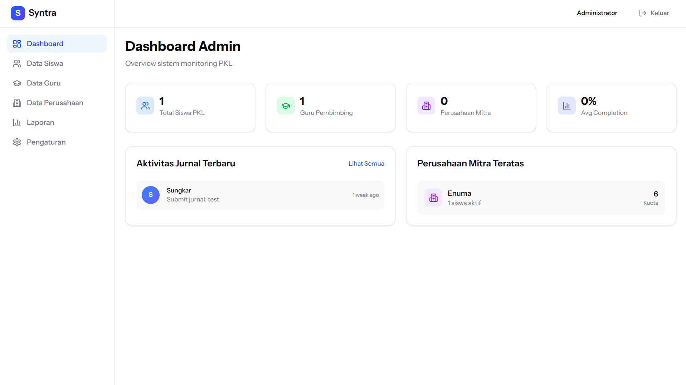

# Syntra - Platform Monitoring PKL Modern



Syntra adalah platform modern berbasis web yang dirancang untuk mempermudah manajemen, pemantauan, dan pelaporan kegiatan Praktik Kerja Lapangan (PKL) secara real-time. Aplikasi ini memfasilitasi kolaborasi yang efisien antara Siswa, Guru Pembimbing, dan Admin Sekolah.

## Fitur Utama
### 👨‍🎓 Siswa (Student)
- **Dashboard Kerja**: Memantau progress PKL saat ini.
- **Jurnal Harian**: Pengisian dan pengelolaan logbook aktivitas harian selama PKL.
- **Manajemen Tugas**: Melihat daftar tugas yang diberikan oleh guru pembimbing.
- **Sistem Notifikasi**: Mendapatkan pemberitahuan langsung terkait persetujuan jurnal atau tugas baru.
- **Profil Mandiri**: Mengelola data diri siswa.

### 👩‍🏫 Guru Pembimbing (Teacher)
- **Review Jurnal**: Menyetujui atau menolak jurnal harian yang diajukan oleh siswa bimbingan.
- **Monitoring Siswa**: Melihat detail kemajuan dan status PKL dari setiap siswa secara spesifik.
- **Penilaian & Tugas**: Memberikan instruksi tugas dan melakukan penilaian performa.
- **Notifikasi Terintegrasi**: Pemberitahuan saat ada jurnal baru yang perlu ditinjau.

### ⚡ Admin Sistem (Admin)
- **Manajemen Pengguna**: CRUD data siswa dan guru pembimbing.
- **Manajemen Perusahaan**: Mengelola data mitra industri tempat PKL (Perusahaan).
- **Pusat Laporan**: Mengekspor data rekapitulasi jurnal dan siswa ke format dokumen.
- **Pengaturan Sistem**: Konfigurasi global platform.

## Deploy Cepat dengan Docker

Setup ini sudah disiapkan untuk deploy di Droplet DigitalOcean dengan SQLite, Caddy, dan HTTPS otomatis. Setelah DNS A record subdomain diarahkan ke IP Droplet, jalankan:

```bash
docker compose up -d --build
```

Domain deploy sekarang sudah diset ke `syntra.stefanonirwana.dev`.

Kalau `APP_KEY` kosong, container akan membuat dan menyimpannya otomatis di volume `storage`. Seeder juga sudah disiapkan untuk akun demo:

- `admin@syntra.test` / `password`
- `teacher@syntra.test` / `password`
- `student@syntra.test` / `password`

Database SQLite, session, dan cache disimpan di volume Docker, jadi data tetap aman saat container restart.

 Consider giving a star pls :D